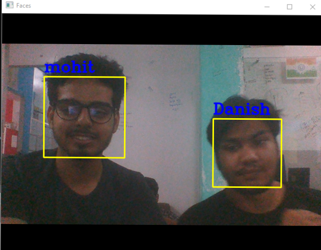

# Face-Recognition
This repository contains code for the project : face recognition . kNN is used as a classifier to recognize images from our generated dataset.

### Packages Requried :
  - numpy
  - opencv
  - os
  
  
### Files :
  * face_collect_data.py - This file collects the images of user using webcam and store in a x.npy file under "data" directory.
  * face_recognition.py - Recognition of face is done using this file.
  * haarcascade_frontalface_alt.xml - This file is used as a helper file to detect the faces in an image ( OpenCV )
  
### Instructions :
  * Run face_collect_data.py `python face_collect_data.py` to collect data of your face. Collect atleast 10 instances.
  * Run face_recognition py `python face_recognition.py` to recognize the faces from webcame.
  
  ### Results : 
  
    
   
  
